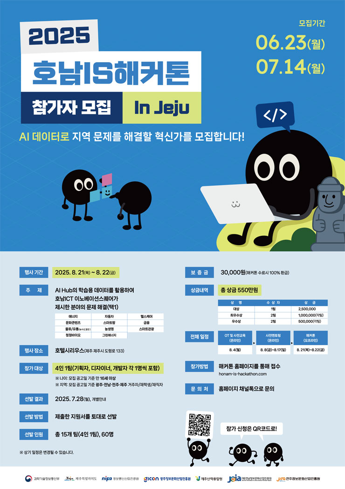
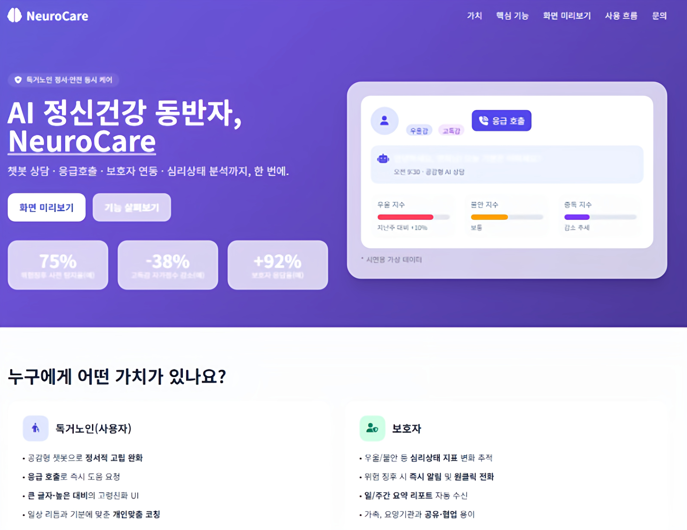
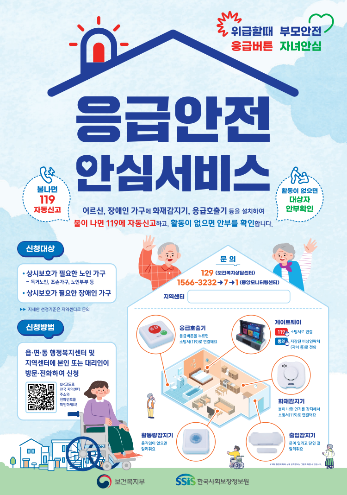
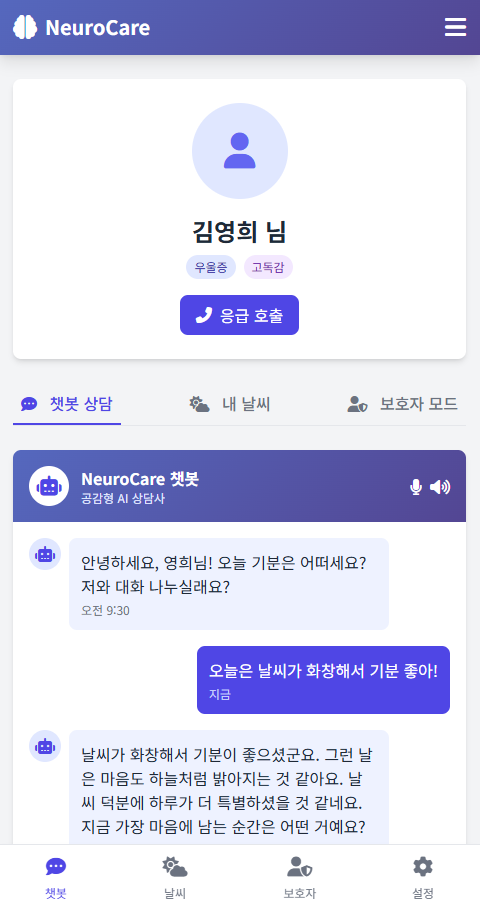
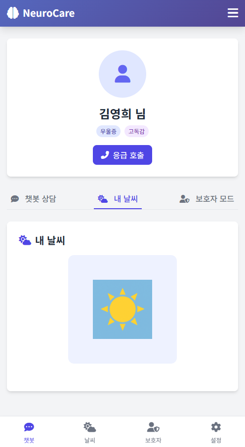
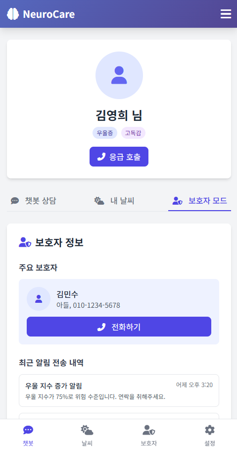
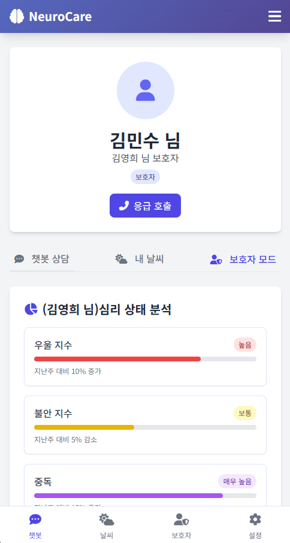
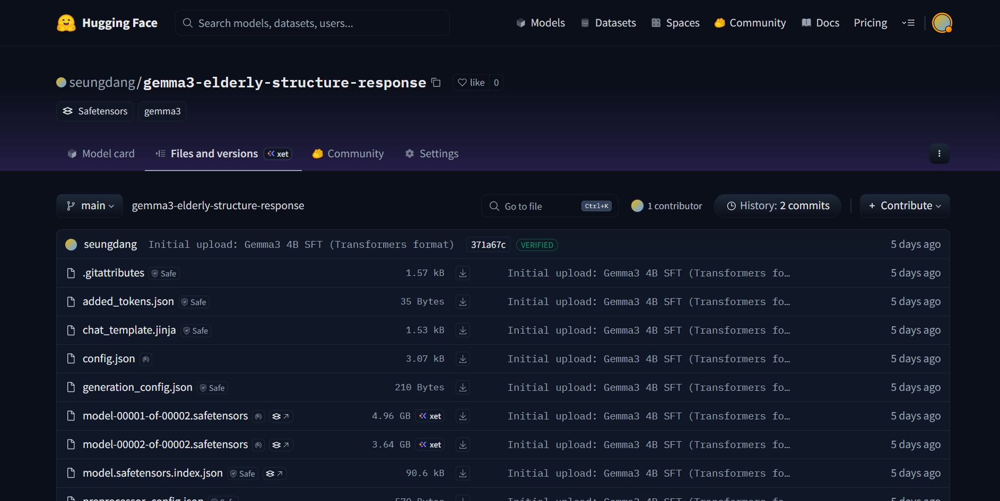

# NeuroCare

## 프로젝트 배경

이 프로젝트는 **호남IS 해커톤**(25.08.21 ~ 25.08.22)에 참가하여 진행되었습니다.  
해커톤 주제는 *“AI Hub의 학습용 데이터를 활용하여 호남ICT 이노베이션스퀘어가 제시한 분야의 문제 해결”*이었으며,  
저희 팀은 고령화 사회에서 점점 심각해지고 있는 **독거노인의 정서적·심리적 돌봄 문제**를 해결 과제로 선정했습니다.



## 혼자 계신 어르신들의 마음을 돌보는 AI 동반자



---

## 1. 서비스 개요

**NeuroCare**는 독거 노인 분들의 **정서적 안정과 심리적 돌봄**을 목표로 하는 AI 챗봇 서비스이다.  
AI 기반 공감형 대화를 통해 **우울, 불안, 고독감** 등의 정서를 조기에 감지하고, 보호자에게 **심리 리포트 및 알림 서비스**를 제공한다.

또한, 추후에는 **응급안전안심서비스 기기와 결합**하여 IoT 기반의 신체적 안전(화재·가스·낙상 등)과 뉴로케어를 통한 **정신적 안전**을 통합적으로 제공하는 것을 목표로 한다.  
다만 이번 프로젝트는 해커톤이라는 한정된 시간과 자원 속에서 진행되었기에, 실제 IoT 기기 연계 대신 **챗봇과 간단한 UI 중심의 프로토타입 형태**로 구현되었다.

<br>

<a href="https://www.korea.kr/news/reporterView.do?newsId=148913882" target="_blank">
  ex) 응급안전안심서비스 기기
</a>

<br>

<p align="center">
  
</p>

---

## 2. 서비스 기획 배경

-   **독거 노인 증가**  
    → 고독감이 심리질환·정신질환으로 이어져 사회적 문제 심화

-   **현재 돌봄 서비스의 한계**  
    → 신체 안전(낙상, 화재, 응급)에 치중되어 정서적 안정은 상대적으로 중요하게 다루어지지 않음

-   **보호자 연결 부족**  
    → 가족·보호자가 멀리 떨어져 있어 실시간 심리 상태 파악 어려움

-   **고령화 사회의 심각한 현실**  
    → 우리 사회는 고령화가 빠르게 진행되고 있으며, 노인 3명 중 1명이 우울증을 겪고 있음  
    → 우울증 환자는 자살 위험이 일반인보다 **3.8배** 높음  
    → 2023년 기준, 하루 평균 **10.5명의 노인**이 자살  
    → 우울증과 고독감은 노인 자살 위험을 높이는 **치명적 요인**  
    → 우울증은 단순한 정신적 질환을 넘어 신체적 질환과도 밀접하게 연관됨  
    → 독거노인의 비율이 매년 증가하면서 신체적·정신적 위험은 더욱 커지고 있음

📌 NeuroCare는 신체적 안전뿐만 아니라 **심리적 안정까지 함께 돌볼 수 있는 서비스**를 지향한다.

<br>

## 3. 문제점 정의

### 1) 심리적 돌봄 공백

-   고령화가 가속화되면서 노인 **3명 중 1명이 우울증**을 겪고 있으며,  
    우울증 환자의 자살 위험은 일반인보다 **3.8배** 높음
-   2023년 기준 하루 평균 **10.5명의 노인 자살**이 발생할 정도로,  
    고독감과 우울감은 노인의 생명에 직결되는 심각한 위험 요인
-   기존 돌봄 서비스는 신체적 안전 위주로 운영되어,  
    정서적 안정과 심리적 케어가 충분히 제공되지 못함

### 2) 지역 돌봄 서비스 한계

-   지자체 및 기관이 제공하는 돌봄 인력은 한정적 →  
    모든 독거노인에게 맞춤형 정서 지원을 제공하기 어려움
-   이로 인해 돌봄 서비스가 닿지 않는 **사각지대**가 발생

### 3) 보호자 연결 미흡

-   가족·보호자가 멀리 떨어져 있어 **실시간 심리 상태 파악이 어려움**
-   심리적 위기 상황(우울 지수 급상승, 자살 위험 등) 발생 시  
    **즉각 대응이 곤란**
-   상태 변화가 장기적으로 누적·시각화되지 않아  
    보호자와 의료진이 체계적인 관리하기 어려움

---

## 4. 서비스 핵심 기능

1. **심리질환 조기 진단**

    - 대화 기반 우울·불안·중독 등 위험 징후 감지

2. **공감형 대화 챗봇**

    - aihub의 *고령자 근현대 경험 기반 스토리 구술 데이터*를 활용해 데이터셋을 구축하고,  
      **gemma3-4b 모델을 LoRA 방식으로 파인튜닝** 진행
    - 단순히 ‘공감형 어휘’를 사용하는 대화보다, 노인들이 **자신의 과거 경험을 회상하고 이야기할 때**  
      심리적 안정감을 느낀다는 점에 착안
    - 실제 파인튜닝 테스트 결과, 사용자의 과거 경험을 자연스럽게 유도하여  
      보다 깊이 있는 **공감형 대화**가 가능함을 확인

3. **정서 상태 시각화**
    - ☀ 안정 / ⛅ 약간 불안 / 🌧 우울 / ⛈ 위험
    - 직관적 UI로 심리 변화 추적 가능

---

## 5. 사용자 경험 흐름 (UX 시나리오)

### 사용자 (노인)

1. **대화 시작**

    - 챗봇과 텍스트 기반으로 일상적인 대화를 나눔
    - 단순한 공감형 어휘를 넘어, 학창 시절·가족사·일터 경험 등 **과거 경험을 자연스럽게 회상**하도록 유도
    - 사용자는 자신의 이야기를 존중받는 느낌을 얻고, 이를 통해 정서적 안정감을 경험

2. **심리 상태 피드백**

    - 대화 내용은 AI 모델에 의해 분석되어 우울·불안·중독 등 위험 징후를 감지
    - 결과는 **날씨 아이콘(☀ 안정 / ⛅ 약간 불안 / 🌧 우울 / ⛈ 위험)**으로 직관적으로 시각화
    - 사용자는 매일 변하는 심리 상태를 부담 없이 확인할 수 있음

3. **안전 장치**
    - 사용자가 직접 알림 임계치를 설정할 수 있으며, 위험 신호 발생 시 보호자에게 즉시 알림 전달
    - 노인은 챗봇을 통해 정서적 지지를 받는 동시에, 위기 상황 시 빠른 대응이 가능하다는 **심리적 안전망**을 확보

<br>

### 보호자

1. **심리 상태 리포트 확인**

    - 보호자는 **연결된 노인의 심리 상태 요약 리포트**를 통해 상황을 한눈에 파악
    - 단순 지표뿐 아니라 _주요 증상, 위험 요인, 개선 요인, 상담사의 개입 요인_ 등 **구조화된 분석 정보**를 제공받아 이해가 용이

2. **위험 알림 수신**

    - 우울·불안 지수가 설정된 임계치를 초과하면 보호자에게 즉시 알림 전달
    - 멀리 떨어져 있어도 노인의 **정서적 위기 상황을 실시간으로 인지**하고 대응 가능

3. **임계치 조정 및 맞춤형 설정**
    - 보호자는 상황에 맞게 알림 빈도와 임계치를 유연하게 조정
    - 필요 시 의료·돌봄 서비스와 연계하여 **돌봄 사각지대를 최소화**

---

## 6. 구현된 UI 화면

<table>
  <tr>
    <td align="center">
      <br/>
      <sub>영희 챗봇 화면</sub>
    </td>
    <td align="center">
      <br/>
      <sub>영희 날씨 UI</sub>
    </td>
  </tr>
  <tr>
    <td align="center">
      <br/>
      <sub>영희 프로필</sub>
    </td>
    <td align="center">
      <br/>
      <sub>민수 프로필</sub>
    </td>
  </tr>
</table>

---

## 7. 기술 구성 요소

### AI 모델

-   **심리질환 분류 모델**: PyTorch 기반 Transformer - klue-bert 모델 학습(우울, 불안 등 분류)
-   **대화 모델 (LLM)**: RunPod Serverless VLLM에 배포 (gemma3-4b 모델 파인튜닝)  
    <a href="https://huggingface.co/seungdang/gemma3-elderly-structure-response" target="_blank">👉 Hugging Face 튜닝 모델 바로가기</a>

<p align="center">
  
</p>

<br>

### 백엔드

-   **FastAPI**: AI 모델과 대화 API 서버
-   **Spring Boot**: 사용자 관리, 보호자 리포트 로직

<br>

### 프론트엔드

-   **HTML/CSS/JS**: 기본 UI

<br>

### 실행 환경

-   **RunPod**: LLM 및 심리 분석 모델 실행
-   **NoSQL DB**: 대화 로그 및 심리 상태 기록 저장

<br>

### 데이터

-   **원천 데이터**: AI Hub `고령자 근현대 경험 기반 스토리 구술 데이터`
-   **선정 이유**: 단순히 ‘공감형 어휘’를 사용하는 대화가 아니라, **과거 경험을 회상하도록 유도하는 구조**가 많아 노년층의 정서 안정에 직접적으로 도움이 되는 공감형 대화 학습에 적합

<br>

#### 데이터 정제 및 가공 과정

1. **JSON → JSONL 통합 변환**

    - 여러 개의 JSON 대화 파일을 하나의 JSONL 파일로 통합
    - 대화 구조(`messages`)를 보존해 이후 재가공에 용이한 **중간 포맷**으로 정리

2. **텍스트 정제**

    - `sanitize()` 함수로 불필요한 공백·특수문자 제거
    - `normalize_question()`으로 질문 문두의 추임새(“네네”, “음”, “아” 등)를 제거하고 최소 길이 필터 적용
    - 질문에 물음표 보정, 짧거나 불완전한 발화는 제외하여 데이터 품질 확보

3. **시스템 프롬프트 부여**

    - 모든 대화에 **고정 시스템 프롬프트**(`GLOBAL_SYSTEM_PROMPT`)를 삽입  
      → “당신은 존댓말을 쓰는 따뜻한 ‘친구 같은’ 대화상대입니다...”
    - 일부 샘플에는 메타 정보(핵심 감정 키워드)를 추가, 그러나 과의존 방지를 위해 **30% 확률로 드롭아웃**

4. **대화 쌍 생성 (QA → Samples)**

    - 원본 데이터의 `answer` → `user`, 다음 차례의 `question` → `model`로 역할 재구성
    - 최대 6턴까지의 대화로 확장하여 **사용자(노인 화자) 발화 → 상담자(챗봇) 응답** 구조로 변환
    - 대화 길이가 짧거나 품질 점수가 낮은(`qualityPoint < 3`) 데이터는 제외

5. **JSONL → CSV 변환**

    - JSONL에 저장된 메시지들을 텍스트 placeholder와 함께 CSV로 병렬 저장
    - 이후 학습/검증 시 용이하게 활용 가능

6. **Chat Template 적용 (JSONL → TEXT)**

    - Hugging Face `AutoTokenizer`의 **Gemma3 chat template** 적용
    - `messages_to_text()` 함수로 최종 학습 가능한 `text` 필드 생성
    - `datasets.Dataset` 형태로 변환 후 `save_to_disk()`로 저장

7. **Train / Validation 분리**
    - `Training` 폴더 데이터 → `dataset_train`
    - `Validation` 폴더 데이터 → `dataset_val`
    - 각각 JSONL, CSV, Hugging Face Dataset 포맷으로 저장

#### 예시 샘플 (훈련 데이터)

```json
{
	"messages": [
		{
			"role": "system",
			"content": "당신은 존댓말을 쓰는 따뜻한 '친구 같은' 대화상대입니다..."
		},
		{ "role": "user", "content": "어제 공원에 다녀왔는데 꽃들이 만개해 있었어요." },
		{ "role": "model", "content": "그 공원에서 어떤 기억이 떠오르셨나요?" }
	]
}
```

➡️ 이렇게 정제된 데이터셋을 활용해 **gemma3-4b 모델을 LoRA 방식으로 파인튜닝**하여, 단순 공감 어휘를 넘어서 **과거 경험 회상 기반의 공감형 대화 챗봇**을 구현하였다.

<br>

#### 파인튜닝 과정

1. **환경 설정 및 최적화**

    - TorchDynamo, Unsloth 컴파일러를 비활성화하여 예기치 않은 그래프 최적화 문제 방지
    - Hugging Face 캐시를 별도 디렉토리(`/workspace/hf_home`)로 지정하여 안정적 다운로드 및 저장 관리
    - 기존 캐시(컴파일/패치) 삭제로 재현성 확보

2. **모델 로드 및 양자화**

    - Base 모델: `unsloth/gemma-3-4b-it`
    - `FastModel.from_pretrained()`을 사용하여 **4bit 양자화**(bnb-4bit)로 로드 → GPU 메모리 사용량 절감
    - 최대 입력 길이: 1024 토큰

3. **LoRA 어댑터 적용 (PEFT)**

    - 타겟 모듈: `q_proj`, `k_proj`, `v_proj`, `o_proj`, `gate_proj`, `up_proj`, `down_proj`
    - 하이퍼파라미터:
        - Rank `r = 64`
        - LoRA Alpha = 64
        - Dropout = 0
        - Gradient Checkpointing 비활성화
    - 약 **2~3% 파라미터만 학습**하여 효율적인 SFT 진행

4. **데이터셋 로드**

    - 이전 단계에서 생성한 `dataset_train`, `dataset_val`을 Hugging Face `load_from_disk()`로 불러옴
    - 검증용 데이터셋은 `val_small`(부분 샘플)도 별도 준비

5. **학습 설정 (SFTTrainer)**

    - Trainer: Hugging Face TRL의 `SFTTrainer` 활용
    - 주요 설정:
        - 최대 학습 스텝: 100~1200 (실험 버전에 따라 다름)
        - Warmup steps: 20(테스트) / 500(실제 학습)
        - 배치 크기: train 24~96, eval 24~64
        - Gradient Accumulation: 1~2
        - Learning rate: 2e-4 (Cosine scheduler)
    - 로깅/평가/저장:
        - 20 step마다 train loss 출력
        - 100~300 step마다 검증 loss 평가
        - EarlyStoppingCallback 적용 → 5회 연속 개선 없으면 중단
        - `eval_loss`를 기준으로 Best Model 자동 로드

6. **응답 학습 방식**

    - `train_on_responses_only()` 사용  
      → `user` 발화를 입력, `model` 응답만 학습 대상  
      → 과거 경험 회상을 유도하는 챗봇 특화 학습 가능

7. **학습 모니터링**

    - `LossPrinter` 콜백으로 step별 train/eval loss를 콘솔에 출력
    - 최종 `trainer.evaluate()`로 검증셋 성능 확인

8. **추론(Inference) 파이프라인**

    - 학습 시 사용한 **Global System Prompt** 그대로 유지
    - 사용자 발화(`user`) + 시스템 프롬프트(`system`) → 모델 입력
    - `generate()` 시 스톱 토큰 `<end_of_turn>` 지정
    - 후처리 단계에서 질문부가 중복되면 첫 번째 질문까지만 유지, 물음표 보정 처리

9. **모델 저장 및 배포**
    - `model.save_pretrained_merged()`로 LoRA 어댑터 병합 후 FP16 모델 저장
    - Hugging Face Hub에 업로드 (`seungdang/gemma3-elderly-structure-response`)
